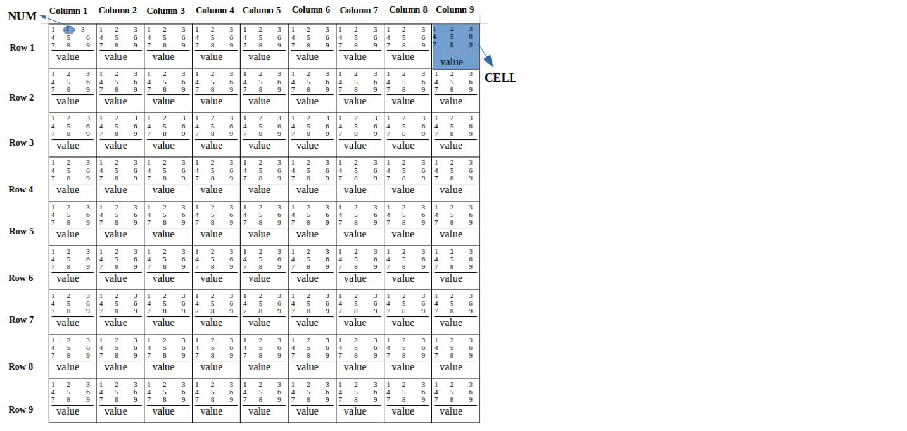

# Sudoku_SOLVER

## This is how sudoku is structured.

The CELL is a struct which is composed of one integer named 'actual value'
and an array of 9 integers named 'flag'.

The integers in 'flag' array takes the value 1 or 0.
The 9 integers represents the possible numbers ('NUM' in picture) that can be assigned 
in the 'actual value' of the CELL.

Example: if the possible numbers that we can assign are 3 and 6 then 
the array will have the below values 110110111.

 1->Number 1 can not be assigned 
 1->Number 2 can not be assigned 
 0->Number 3 can be assigned 
 1->Number 4 can not be assigned 
 1->Number 5 can not be assigned 
 0->Number 6 can be assigned 
 1->Number 7 can not be assigned 
 1->Number 8 can not be assigned 
 1->Number 9 can not be assigned 

The program reads the initial values of sudoku from the file called [sudoku.txt](sudoku.txt)
The file is written by the user ,who must write 0 if the cell is blank or a number from 1 to 9.(initial values of sudoku)
Also the file is filled row by row.
  
 The first number in the file is  [row 1][column 1] 
 The second number in the file is [row 1][column 2] 
 The third number in the file is  [row 1][column 3] 
 ....... 
 ....... 
 ....... 
 The eighty one number in the file is  [row 9][column 9] 
After the sequence of numbers added in the file, user must leave a single space.

The insertion of the initial values is also implemented with user interface where the program
asks the users to insert the value of a certain CELL.
 For example:"Enter the number of 1st row 1st column": 
 The second implementation can be activated with MACRO's inside the file [sudoku_solver.h](sudoku_solver.h) 

 There are 2 MACRO's 
 #define USER_INPUT 0 
 #define FILE_INPUT 1 
 write 1 to USER_INPUT and 0 to FILE_INPUT to enable USER_INPUT. 

